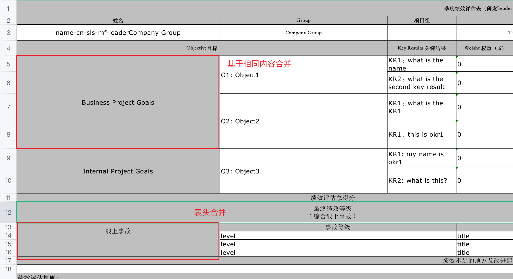

# go-xlsx-templater

Simple **.xlsx** (Excel XML document) template based document generator using handlebars.

Takes input **.xlsx** documents with mustache sippets in it and renders new document with snippets replaced by provided
context.

Thanks to `github.com/tealeg/xlsx` and `github.com/aymerick/raymond` for useful libs.

[Godoc](https://godoc.org/github.com/sjqzhang/go-xlsx-templater)

## Installation

```
    go get -u "github.com/sjqzhang/go-xlsx-templater"
```

## Usage

### Import to your project

```go
    import "github.com/sjqzhang/go-xlsx-templater"
```

### Prepare **template.xlsx** template.

Filename may be any of course. For slices use dot notation `{{items.name}}`. When parser meets dot notation it will
repeats contains row. If you need repeat few rows, or have nested slices, you can use range start `{{range groups}}`
and `{{end}}`.


### Prepare context data

```go
    ctx := map[string]interface{}{
"name": "Github User",
"groupHeader": "Group name",
"nameHeader": "Item name",
"quantityHeader": "Quantity",
"groups": []map[string]interface{}{
{
"name":  "Work",
"total": 3,
"items": []map[string]interface{}{
{
"name":     "Pen",
"quantity": 2,
},
{
"name":     "Pencil",
"quantity": 1,
},
},
},
{
"name":  "Weekend",
"total": 36,
"items": []map[string]interface{}{
{
"name":     "Condom",
"quantity": 12,
},
{
"name":     "Beer",
"quantity": 24,
},
},
},
},
}
```

### Read template, render with context and save to disk.

Error processing omited in example.

```go
    doc := xlst.New()
doc.ReadTemplate("./template.xlsx")
doc.Render(ctx)
doc.Save("./report.xlsx")
```

### Enjoy created report


### Cell Merge Example

if you want to merge cells, the data ctx key must be endswith `_merge` and the content must be same, for example:

```json
{
  "accident": [
    {
      "description": "title",
      "level": "level",
      "title_merge": "线上事故"
    },
    {
      "description": "title",
      "level": "level",
      "title_merge": "线上事故"
    },
    {
      "description": "title",
      "level": "level",
      "title_merge": "线上事故"
    }
  ],
  "group": "Company Group",
  "manager": "",
  "name": "name-cn-sls-mf-leader",
  "okrs": [
    {
      "category_merge": "Business Project Goals",
      "completion": "",
      "info_merge": "O1: Object1",
      "keyResult": "KR1：what is the name",
      "remark": "",
      "score": 0,
      "weight": 0,
      "weightScore": 0
    },
    {
      "category_merge": "Business Project Goals",
      "completion": "",
      "info_merge": "O1: Object1",
      "keyResult": "KR2：what is the second key result",
      "remark": "",
      "score": 0,
      "weight": 0,
      "weightScore": 0
    },
    {
      "category_merge": "Business Project Goals",
      "completion": "",
      "info_merge": "O2: Object2",
      "keyResult": "KR1：what is the KR1",
      "remark": "",
      "score": 0,
      "weight": 0,
      "weightScore": 0
    },
    {
      "category_merge": "Business Project Goals",
      "completion": "",
      "info_merge": "O2: Object2",
      "keyResult": "KR1：this is okr1",
      "remark": "",
      "score": 0,
      "weight": 0,
      "weightScore": 0
    },
    {
      "category_merge": "Internal Project Goals",
      "completion": "",
      "info_merge": "O3: Object3",
      "keyResult": "KR1: my name is okr1",
      "remark": "",
      "score": 0,
      "weight": 0,
      "weightScore": 0
    },
    {
      "category_merge": "Internal Project Goals",
      "completion": "",
      "info_merge": "O3: Object3",
      "keyResult": "KR2: what is this?",
      "remark": "",
      "score": 0,
      "weight": 0,
      "weightScore": 0
    }
  ],
  "quarter": "Q1",
  "reviewOverall": "",
  "reviewResult": "",
  "role": "Tech Leader",
  "team": "",
  "totalScore": 0
}
```


```go
    doc := xlst.New()
    doc.ReadTemplate("./demo/okrTemplate.xlsx")
    var ctx map[string]interface{}
    json.Unmarshal([]byte(js), &ctx)
    doc.Render(ctx)
    doc.Save("./demo/report.xlsx")
```



## Documentation

#### type Xlst

```go
type Xlst struct {
// contains filtered or unexported fields
}
```

Xlst Represents template struct

#### func  New

```go
func New() *Xlst
```

New() creates new Xlst struct and returns pointer to it

#### func (*Xlst) ReadTemplate

```go
func (m *Xlst) ReadTemplate(path string) error
```

ReadTemplate() reads template from disk and stores it in a struct

#### func (*Xlst) Render

```go
func (m *Xlst) Render(ctx map[string]interface{}) error
```

Render() renders report and stores it in a struct

#### func (*Xlst) Save

```go
func (m *Xlst) Save(path string) error
```

Save() saves generated report to disk

#### func (*Xlst) Write

```go
func (m *Xlst) Write(writer io.Writer) error
```

Write() writes generated report to provided writer
